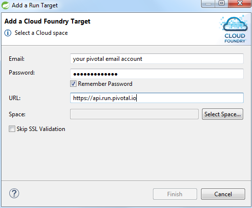

This project has been done to test some Spring and Pivotal Cloudfoundry features


# Springboot overview


- Create stand-alone Spring applications

- Embed Tomcat, Jetty or Undertow directly (no need to deploy WAR files)
```java
package com.pcfdemo;
import org.springframework.boot.SpringApplication;
import org.springframework.boot.autoconfigure.SpringBootApplication;
@SpringBootApplication
public class PcfdemoApplication {
	public static void main(String[] args) {
		SpringApplication.run(PcfdemoApplication.class, args);
	}
}
```

- Provide opinionated `starter` POMs to simplify your Maven configuration (`spring-boot-starter-activemq`, `spring-boot-starter-jdbc`, `spring-boot-starter-web`, `spring-boot-starter-mail`, `spring-boot-starter-data-jpa`, ...)
```xml
<parent>
    <groupId>org.springframework.boot</groupId>
    <artifactId>spring-boot-starter-parent</artifactId>
    <version>1.4.1.RELEASE</version>
</parent>
<dependencies>
    <dependency>
        <groupId>org.springframework.boot</groupId>
        <artifactId>spring-boot-starter-web</artifactId>
    </dependency>
    <dependency>
        <groupId>org.springframework.boot</groupId>
        <artifactId>spring-boot-starter-data-jpa</artifactId>
    </dependency>
</dependencies>
```

- Automatically configure Spring whenever possible : the `@SpringBootApplication` will search under sub package all spring annotations and uses them to configure application (`@Bean`, `@RestController`, `@Configuration`, `@Profile`, ...)

- Provide production-ready features such as metrics, health checks and externalized configuration

- Absolutely no code generation and no requirement for XML configuration


[Quick Start](http://projects.spring.io/spring-boot/) [Documentation](http://docs.spring.io/spring-boot/docs/2.0.0.BUILD-SNAPSHOT/reference/htmlsingle/)


### Spring data jpa

Add this starter in the pom.xml `spring-boot-starter-data-jpa`

-  JPA based on `hibernate` implementation

```java
@Entity
public class User {
@Id
@GeneratedValue(strategy = GenerationType.AUTO)
private Long userId;
@Column(nullable = false, length = 20)
private String name;
@Column(nullable = false, length = 20)
private String firstName;
...	 
```

- provides a simple way to request database without code

  - the [JpaRepository](http://docs.spring.io/spring-data/jpa/docs/1.3.0.RELEASE/reference/html/jpa.repositories.html) interface provides all the commons methods to request a database
  ```java
  List<T> findAll();
  List<T> findAll(Iterable<ID> ids);
  <S extends T> List < S > save(Iterable < S > entities);
  T getOne(ID id);
  ...
  ```
  - developers can create custom queries based on naming [conventions](http://docs.spring.io/spring-data/jpa/docs/current/reference/html/#jpa.query-methods.query-creation) or on `JPQL`
```java
  public List<User> findByNameContainingIgnoreCase(final String name);
  public List<User> findAllByOrderByName();
  @Query("select u from User u where u.name not like %?1%")
  public List<User> findByNameContainingNot(final String name);
```

[Quick Start](http://projects.spring.io/spring-data-jpa/) [Documentation](http://docs.spring.io/spring-data/jpa/docs/1.11.0.M1/reference/html/)


### Spring REST

Add this starter in the pom.xml `spring-boot-starter-web`

- base on simple annotations to declare `RestController`,  methods and `path`
```java
@RestController
@RequestMapping("/user")
public class UserController {
@Autowired
private UserRepository userRepository;
@RequestMapping("/help")
public String ping() {
  return "User service";
}
```

- provide an easy way to get path variable or request parameter
```java
@RequestMapping(path = "/findbynamecontaining", method = RequestMethod.GET)
public List<User> findByNameContaining(@RequestParam String name) {
  return userRepository.findByNameContainingIgnoreCase(name);
}
@RequestMapping(path = "/{id}", method = RequestMethod.DELETE)
public String delete(@PathVariable Long id) {
  userRepository.delete(id);
  return "ok";
}
```

# CloudFoundry integration using STS

First of all, you need to create an account on [Pivotal](https://pivotal.io/platform/pcf-tutorials/getting-started-with-pivotal-cloud-foundry/introduction).

All tests have been done using [Spring Tool Suite](https://spring.io/tools) (STS).

Download the project from GitHub and import it in your STS Workspace.

### CloudFoundry Initialization

### CloudFoundry settings in STS

Open the Boot Dashboard view in STS `Windows > Show views > Spring > Boot Dashboard`

Configure a new connection (button `+`)

Fill your Pivotal settings



### Deploy application

All information you need to deploy are in the `manifest.yml` under `cloudfoundry` folder

When you first deploy the application, STS propose you a default manifest. You can copy it and create your own with the specific settings. In our situation, we have the service `pcfdemo_mysql`.
It must have been created with the `Pivotal web console`

To deploy the application, you just have to drag and drop the project to your CloudFoundry connection.

And that's all....

After modification of your code, you can `(Re)Start` your application to deploy the changes

### Continuous integration using Concourse.ci


# Test application

[insert data for demo](http://mtpcfdemo.cfapps.io/user/insertDemo)

[find all](http://mtpcfdemo.cfapps.io/user)

[find all order by name](http://mtpcfdemo.cfapps.io/user/findallorderbyname)

[find by id](http://mtpcfdemo.cfapps.io/user/1)

[find by name containing](http://mtpcfdemo.cfapps.io/user/findbynamecontaining?name=b)
